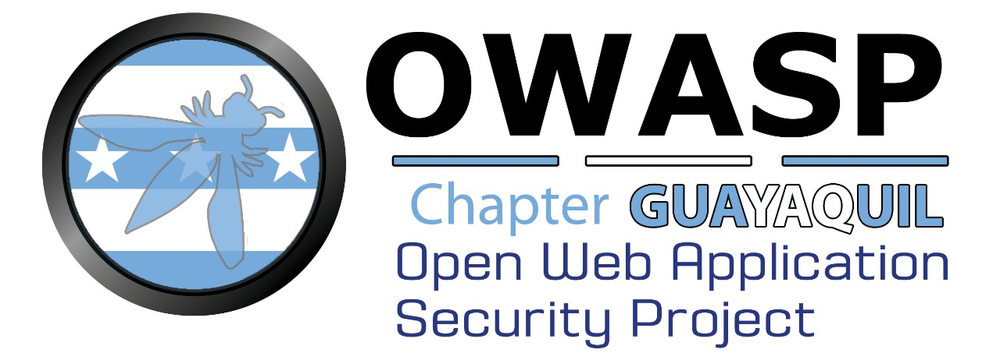

---

layout: col-sidebar
title: OWASP Guayaquil
tags: front-matter
region: South America
meetup-group: OWASP-Guayaquil-Chapter
country: Ecuador
postal-code: 

---

## OWASP Guayaquil Chapter

Bienvenido a la página principal del capítulo Guayaquil, Perla del Pacifico

OWASP Capitulo Guayaquil, es una comunidad dedicada a compartir y generar conocimiento en seguridad de la información, ciberseguridad y tecnologías para fortalecer la creación de software e infraestructuras seguras en Ecuador.

## Team
Estás interesado en formar parte del Grupo de Trabajo del Capítulo Guayaquil? Escríbenos para coordinar nuestras siguientes reuniones virtuales del 2021.

## Meetings
Las reuniones, talleres y eventos del OWASP Guayaquil Chapter están publicados en nuestro Meetup!

Por favor visita y suscríbete en [MeetUp OWASP Guayaquil Chapter](https://www.meetup.com/OWASP-Guayaquil-Chapter/) para recibir toda la información del Chapter.

## Eventos
Realizamos eventos periódicos del Capítulo OWASP Guayaquil en disitintas universidades de Guayaquil.

Visita nuestra página de Meetup para registrarte en los próximos eventos: [MeetUp OWASP Guayaquil Chapter](https://www.meetup.com/OWASP-Guayaquil-Chapter/)

## Acerca de OWASP
El Open Web Application Security Project (OWASP) es una fundación sin fines de lucro que trabaja para mejorar la seguridad del software. Nuestros proyectos incluyen:

- Proyectos de software de código abierto liderados por la comunidad.
- Más de 275 capítulos locales en todo el mundo.
- Decenas de miles de miembros.
- Conferencias educativas y de capacitación líderes en la industria.

Somos una comunidad abierta dedicada a permitir que las organizaciones conciban, desarrollen, adquieran, operen y mantengan aplicaciones confiables. Todos nuestros proyectos, herramientas, documentos, foros y capítulos son libres y están abiertos a cualquier persona interesada en mejorar la seguridad de las aplicaciones. OWASP se lanzó el 1 de diciembre de 2001, se incorporó como organización benéfica sin fines de lucro de los Estados Unidos el 21 de abril de 2004, y el capítulo Guayaquil fue fundado en agosto de 2011. 

Durante casi dos décadas, corporaciones, fundaciones, desarrolladores y voluntarios han apoyado a OWASP y su trabajo. Done, conviértase en miembro, y/o opoye a la comunidad como patrocinador corporativo hoy.
